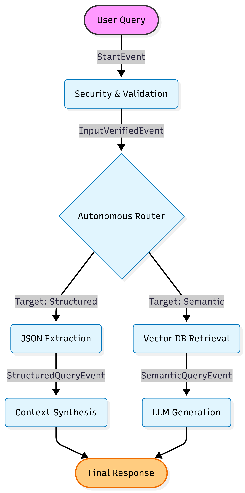

# 🤖 Agentic-Docs-RAG
> **Bridging the Knowledge Gap: A Multi-Layered RAG System for Developer Documentation.**

[](https://www.llamaindex.ai/)
[](https://cohere.com/)
[](https://www.pinecone.io/)

---

## 🍨 Introduction: The Vision
Modern development relies on **Agentic Coding Tools** like *Cursor*, *Claude Code*, and *Kiro*. These tools generate a massive trail of insights, architectural decisions, and "Rule" files hidden in directories like `.cursor` or `.claude`. 

**The Challenge:** This critical project knowledge is often fragmented and hard to retrieve. 
**The Solution:** I built this RAG Agent to serve as a **Single Source of Truth**. By combining high-speed vector retrieval with a structured data engine, the agent ensures that every project rule and every line of documentation is instantly accessible and actionable.

---

## 🙋 Interaction Guide: What can this Agent solve?
My agent doesn't just "search"—it **reasons** about which data source to use based on your intent.

* **Technical Deep-Dive (Semantic):** *"How does the system handle error propagation in the workflow?"*
    * **Action:** The Agent triggers a semantic search across **Pinecone**, analyzing document chunks to explain the underlying logic.
* **Compliance & Rules (Structured):** *"List all mandatory CSS naming conventions defined in our project rules."*
    * **Action:** The Agent bypasses the vector search and goes directly to the **JSON** layer for a 100% accurate, non-hallucinated list.
* **Summarization & Audit:** *"Show me a summary of all architectural warnings extracted from the last 3 months."*
    * **Action:** The Agent synthesizes information from the extracted knowledge base to provide a high-level executive summary.

---

## 🏗️ Architecture: The Event-Driven Workflow
The system is built on a robust **Event-Driven Workflow** that manages the lifecycle of a query:

1. **Input Sanitization:** Cleans the user query and applies safety guardrails.
2. **Autonomous Router:** The LLM acts as a traffic controller, deciding between:
    - **Path A (Semantic):** For conceptual questions, utilizing **Vector Embeddings**.
    - **Path B (Structured):** For data-driven questions, utilizing **JSON Metadata**.
3. **Context Injection:** The retrieved data is injected into a specialized prompt to ensure the answer is grounded in the project's specific context.

### 📊 Workflow Visualization
<p align="center">
  
</p>

---

## 🛠️ The Technology Stack
* **LlamaIndex Workflows:** For managing complex, non-linear logic and event handling.
* **Cohere Command-R+:** Chosen for its superior performance in **RAG** and long-context reasoning.
* **Pinecone DB:** Provides a scalable, cloud-native vector store with metadata filtering.
* **Gradio:** A clean, responsive web interface for real-time developer interaction.

---

## 🚀 Setup & Installation

### 1. Environment Setup
Create a `.env` file in the root directory to store your credentials:
```env
COHERE_API_KEY=your_key_here
PINECONE_API_KEY=your_key_here
```

### 2. Dependency Installation
Make sure your virtual environment is active, then run:
```bash
pip install -r requirements.txt
```

### 3. Data Preparation Pipeline
To populate the knowledge base, run the following scripts in order:
```bash
# Extract structured data into JSON
python extractor.py

# Index unstructured markdown files into Pinecone
python indexing.py
```

### 4. Application Launch
Start the Gradio web server:
```bash
python app.py
```

---

## 🎓 Credits & Acknowledgments

**Developed by:** Chedva Rizi  
**Course:** Advanced AI & RAG Systems, 2026  


### 🍎 Special Thanks
* **Course Instructor:** For the guidance on Agentic Workflows and RAG patterns.
* **LlamaIndex Community:** For the amazing orchestration framework.
* **Cohere & Pinecone:** For providing the robust LLM and Vector storage infrastructure.

---
<p align="center">
  Built with ❤️ and ☕ by a Future AI Engineer
</p>